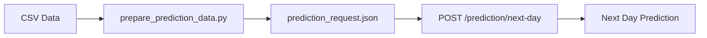

# 📊 Hướng dẫn sử dụng Prediction API với dữ liệu thực tế

## 🎯 Mục đích
API này dự đoán **số lượng bán hàng cho ngày tiếp theo** dựa trên dữ liệu bán hàng của 7-30 ngày trước đó.

## 📁 Chuẩn bị dữ liệu từ CSV

### Bước 1: Chạy script Python để chuẩn bị dữ liệu

```bash
# Copy file data.csv vào thư mục BE_WEB
cp "C:\Users\Admin\Downloads\data.csv\data.csv" "C:\DataVis\BE_WEB\data.csv"

# Cài pandas nếu chưa có
pip install pandas

# Chạy script
python prepare_prediction_data.py
```

Script này sẽ:
- ✅ Đọc file CSV
- ✅ Tổng hợp dữ liệu theo ngày
- ✅ Lấy 14 ngày gần nhất (có thể điều chỉnh)
- ✅ Tạo request body JSON
- ✅ Phân tích xu hướng dữ liệu
- ✅ In curl command để test

### Bước 2: Điều chỉnh cấu hình (trong prepare_prediction_data.py)

```python
CSV_PATH = 'data.csv'              # Đường dẫn file CSV
DAYS = 14                          # Số ngày dữ liệu (7-30 ngày)
STOCK_CODE = None                  # None = tất cả sản phẩm, hoặc '85123A'
COUNTRY = 'United Kingdom'         # None = tất cả quốc gia
```

## 🚀 Sử dụng API

### Endpoint: POST /prediction/next-day

### Request Body Format:

```json
{
  "dailySales": [
    { "date": "2010-12-01", "quantity": 1200 },
    { "date": "2010-12-02", "quantity": 1350 },
    { "date": "2010-12-03", "quantity": 1180 },
    { "date": "2010-12-04", "quantity": 1420 },
    { "date": "2010-12-05", "quantity": 1560 },
    { "date": "2010-12-06", "quantity": 1490 },
    { "date": "2010-12-07", "quantity": 1630 }
  ],
  "stockCode": "85123A",
  "country": "United Kingdom"
}
```

### Response Format:

```json
{
  "success": true,
  "nextDayPrediction": 1750,
  "nextDate": "2010-12-08",
  "confidence": "high",
  "inputPeriod": {
    "from": "2010-12-01",
    "to": "2010-12-07",
    "days": 7
  },
  "trend": "increasing",
  "trendPercent": 8.5,
  "statistics": {
    "mean": 1404,
    "stdDev": 165,
    "min": 1180,
    "max": 1630
  }
}
```

## 📝 Ví dụ thực tế

### Ví dụ 1: Dự đoán tổng doanh số toàn quốc UK

```bash
curl -X POST http://localhost:3000/prediction/next-day \
  -H "Content-Type: application/json" \
  -H "Authorization: Bearer YOUR_TOKEN" \
  -d '{
    "dailySales": [
      { "date": "2010-12-01", "quantity": 15234 },
      { "date": "2010-12-02", "quantity": 16789 },
      { "date": "2010-12-03", "quantity": 14567 },
      { "date": "2010-12-04", "quantity": 18234 },
      { "date": "2010-12-05", "quantity": 19456 },
      { "date": "2010-12-06", "quantity": 17890 },
      { "date": "2010-12-07", "quantity": 20123 },
      { "date": "2010-12-08", "quantity": 21456 },
      { "date": "2010-12-09", "quantity": 19876 },
      { "date": "2010-12-10", "quantity": 22345 },
      { "date": "2010-12-11", "quantity": 23456 },
      { "date": "2010-12-12", "quantity": 21987 },
      { "date": "2010-12-13", "quantity": 24567 },
      { "date": "2010-12-14", "quantity": 25678 }
    ],
    "country": "United Kingdom"
  }'
```

### Ví dụ 2: Dự đoán cho sản phẩm cụ thể

```bash
curl -X POST http://localhost:3000/prediction/next-day \
  -H "Content-Type: application/json" \
  -H "Authorization: Bearer YOUR_TOKEN" \
  -d '{
    "dailySales": [
      { "date": "2010-12-01", "quantity": 120 },
      { "date": "2010-12-02", "quantity": 135 },
      { "date": "2010-12-03", "quantity": 118 },
      { "date": "2010-12-04", "quantity": 142 },
      { "date": "2010-12-05", "quantity": 156 },
      { "date": "2010-12-06", "quantity": 149 },
      { "date": "2010-12-07", "quantity": 163 }
    ],
    "stockCode": "85123A",
    "country": "United Kingdom"
  }'
```

## 📊 Hiểu kết quả dự đoán

### Các trường trong response:

- **nextDayPrediction**: Số lượng dự đoán cho ngày tiếp theo
- **nextDate**: Ngày được dự đoán (ngày sau ngày cuối cùng trong input)
- **confidence**: Độ tin cậy (high/medium/low)
  - `high`: Dữ liệu ổn định, biến động < 15%
  - `medium`: Dữ liệu có biến động 15-30%
  - `low`: Dữ liệu biến động > 30%
- **trend**: Xu hướng (increasing/decreasing/stable)
  - `increasing`: Tăng > 5%
  - `decreasing`: Giảm > 5%
  - `stable`: Biến động trong khoảng ±5%
- **trendPercent**: Phần trăm thay đổi giữa nửa đầu và nửa sau của dữ liệu
- **statistics**: Thống kê mô tả dữ liệu input

## 🎨 Test với Postman

1. **URL**: `POST http://localhost:3000/prediction/next-day`
2. **Headers**:
   ```
   Content-Type: application/json
   Authorization: Bearer YOUR_TOKEN
   ```
3. **Body**: Copy JSON từ file `prediction_request.json` (được tạo bởi script Python)

## 🎨 Test với Swagger

1. Truy cập: `http://localhost:3000/api-docs`
2. Tìm section **"prediction"**
3. Expand **POST /prediction/next-day**
4. Click **"Try it out"**
5. Paste JSON request body
6. Click **"Execute"**

## 📈 Tips để có dự đoán tốt

1. **Số ngày input tối ưu**: 14-30 ngày
2. **Dữ liệu liên tục**: Không bỏ sót ngày (có thể fill 0 nếu không có sales)
3. **Lọc theo nhóm**: Dự đoán theo sản phẩm/quốc gia sẽ chính xác hơn tổng hợp chung
4. **Xem xu hướng**: Check `trend` và `trendPercent` để hiểu pattern
5. **Kiểm tra confidence**: Nếu `low`, cần thêm dữ liệu hoặc data quality kém

## 🔧 Troubleshooting

### Lỗi: "ONNX model not loaded"
```bash
# Kiểm tra model file
ls src/model/

# Cài onnxruntime-node
npm install onnxruntime-node

# Khởi động lại
npm run start:dev
```

### Lỗi: "Preprocessor not loaded"
```bash
# Kiểm tra file preprocessor.json
cat src/model/preprocessor.json
```

### Prediction không hợp lý
- Kiểm tra dữ liệu input có đúng format không
- Đảm bảo `scaler_min` và `scaler_max` trong preprocessor.json khớp với training data
- Model được train trên data range 1-80995, nếu input ngoài range này có thể kém chính xác

## 📚 Workflow hoàn chỉnh



1. **CSV** → Dữ liệu bán hàng gốc
2. **Python Script** → Tổng hợp theo ngày, format request
3. **JSON File** → Request body đã chuẩn bị
4. **API Call** → Gửi request đến server
5. **Prediction** → Nhận dự đoán cho ngày tiếp theo
